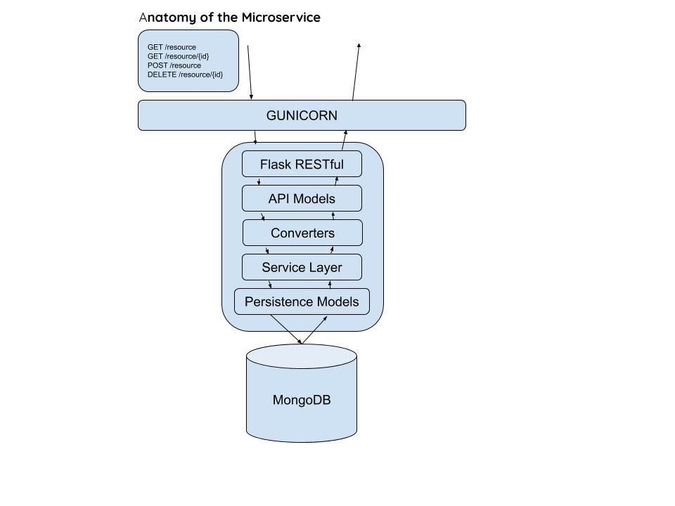

# RESTful Fox
A basic RESTful interface for NFL game statistics for demo to Fox Sport. 

The premise of this project was to try to create a universal behavior for a RESTful microservice running in a docker container. In doing so I had 5 priorities:

* Limit code boilerplate
* Leverage automatic component registration and behavior
  * This was inspired by [Java Spring](https://github.com/spring-projects/spring-boot) behavior
* Universalize Interface Behavior
* Decouple API Models from Persistence Models
* Demonstrate Microservice Environment in Docker

Note: All data was pulled from [Pro Football API](https://profootballapi.com/)

## Structure
The services
- **games**: All NFL Games on the schedule from years 2009-2019
- **game_summary**: The summary and overall statistics of each game, for each team
- **plays**: All plays made for a specific game and the information around them

All microservices follow the following API
- **GET /games** Get all games, or by query parameters
  - Query Parameters
    - **limit**: Limit number of results returned (Default: 1000)
    - **skip**: Skip N results, then apply the limit
    - **order_by**: Order by a given property. e.g. GET /plays&order_by=-year will order by year, descending
- **GET /games/{id}** Get a game by id
- **DELETE /games/{id}** Delete a game by id
- **DELETE /games** Delete all games, or by query parameters
  - Query Parameters
    - **limit**: Limit number of results returned (Default: 1000)
    - **skip**: Skip N results, then apply the limit
    - **order_by**: Order by a given property. e.g. GET /plays&order_by=-year will order by year, descending
- **POST /games** Create a new game

I wanted to focus most on crafting a universal and simply created behavior for a given microservice. All services should follow the pattern below, with a very readable and easy to create universal behavior around them

## Run locally
Docker and docker compose is all that's needed to start this project. Simply clone this repository, and execute the following from the root directory of the cloned directory:
